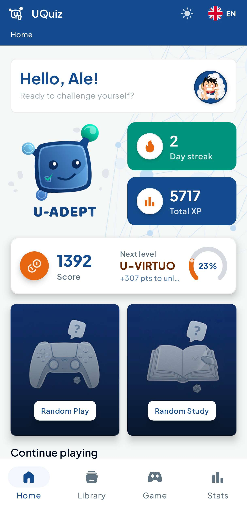
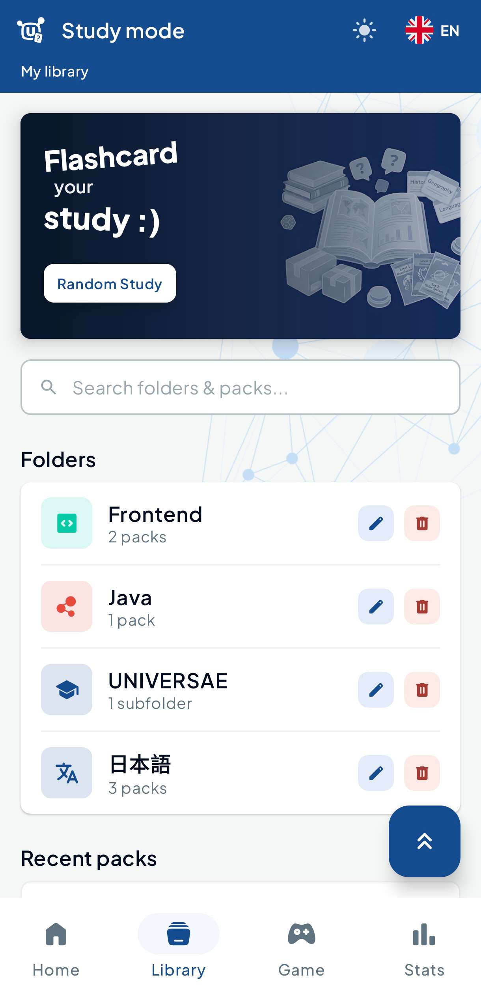
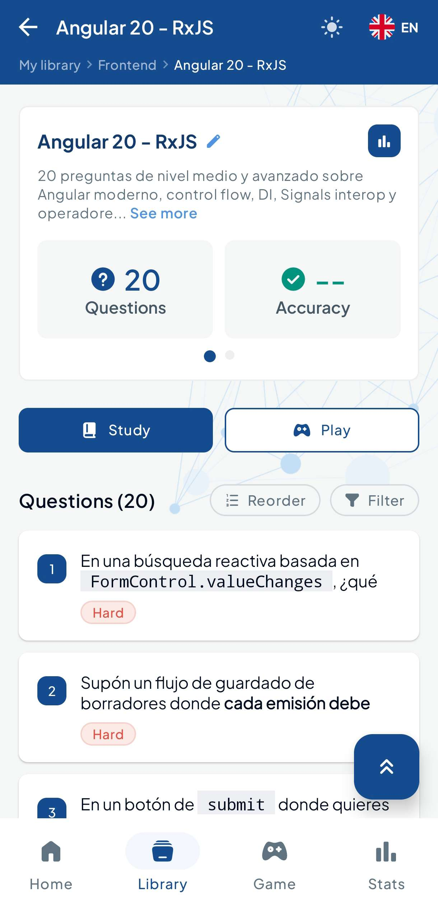
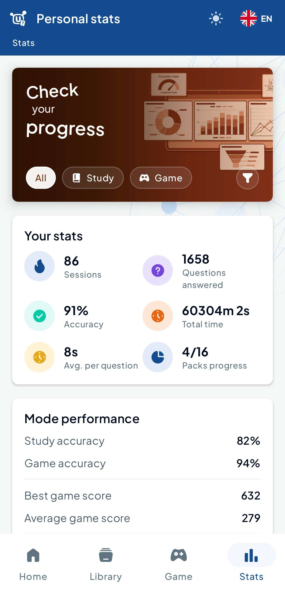
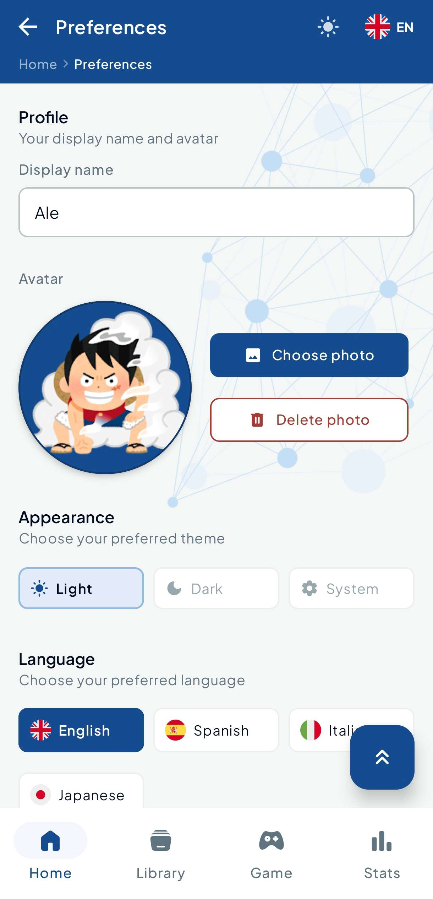
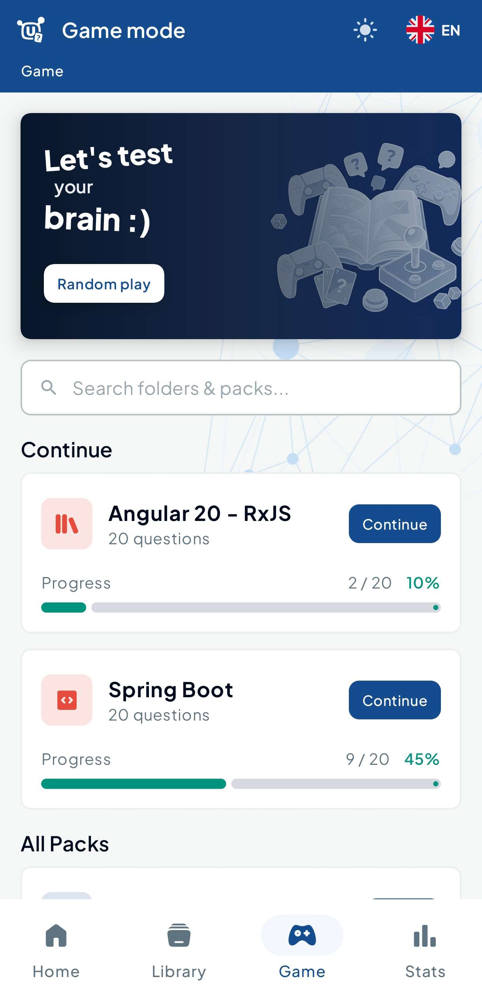
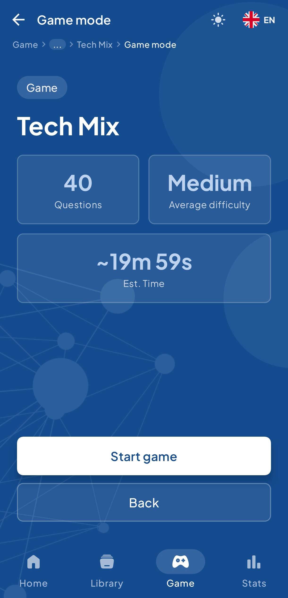
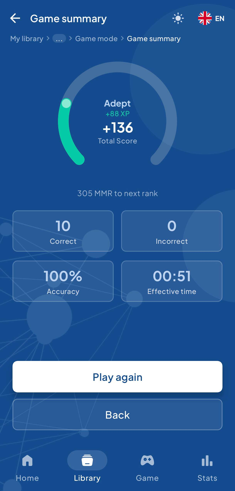
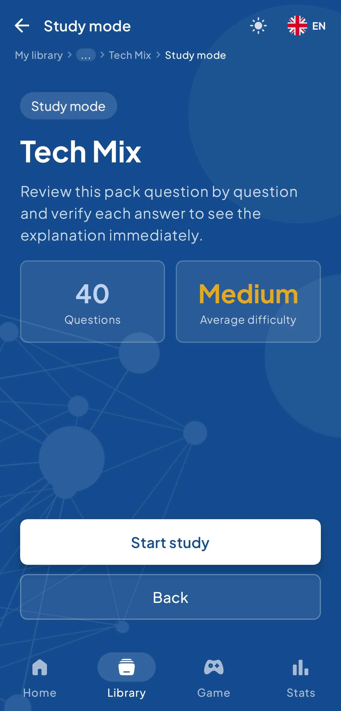
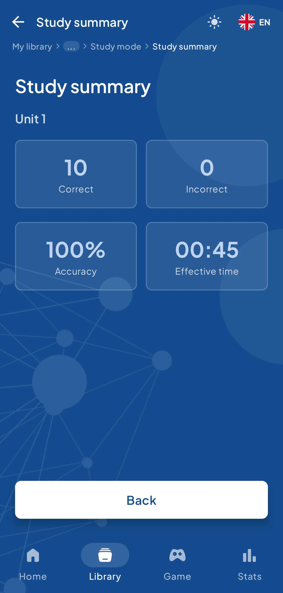

# UQuiz

> An offline-first Android quiz application built with Kotlin and Jetpack Compose, featuring two
> distinct game modes — Study and Game — with adaptive scoring, personal ranking, and full content
> management.

---

## Table of Contents

- [Overview](#overview)
- [Screenshots](#screenshots)
- [Features](#features)
- [Architecture](#architecture)
- [Tech Stack](#tech-stack)
- [Project Structure](#project-structure)
- [Study Mode](#study-mode)
- [Game Mode](#game-mode)
- [Scoring & Ranking System](#scoring--ranking-system)
- [Content Management](#content-management)
- [Design System](#design-system)
- [Internationalization](#internationalization)
- [Testing](#testing)
- [Build & Run](#build--run)

---

## Overview

UQuiz is a personal knowledge-training app that lets users organize questions into **Folders** and *
*Packs**, then practice them through two modes:

- **Study Mode** — review questions at your own pace with immediate feedback and progress tracking.
- **Game Mode** — race against an adaptive countdown timer, earning or losing points based on
  accuracy and speed.

All content and progress is stored locally using **Room**, making the app fully functional offline.

---

## Screenshots

| Home | Library | Pack Details | Stats | Preferences |
|------|---------|--------------|-------|-------------|
|  |  |  |  |  |

| Game Home | Game Session | Game Summary | Study Session | Study Summary |
|-----------|--------------|--------------|---------------|---------------|
|  |  |  |  |  |

---

## Features

### Content Management

- **Folders** — hierarchical organization of Packs with custom icons and colors.
- **Packs** — collections of questions grouped by topic.
- **Questions** — multi-choice questions with a text body, optional explanation, difficulty level,
  and 2–6 answer options.
- **Import / Export** — share packs as `.uquiz` JSON files between devices.

### Study Mode

- Sequential review of all questions in a pack.
- Immediate feedback on each answer (correct/incorrect + explanation).
- Adaptive question ordering based on mastery level.
- Per-session progress tracking (answered, correct, streak).
- Session summary with accuracy, time spent, and XP earned.

### Game Mode

- Adaptive per-question countdown timer scaled by difficulty and question length.
- Score increases with speed (up to ×2 multiplier) and decreases for wrong answers or timeouts.
- Overtime phase — an extra 60-second window after the timer expires where the player can still
  answer, with the bar turning red.
- Session summary with points breakdown, accuracy, and rank progression.

### Statistics

- Per-pack metrics: total sessions, accuracy, average duration, best score.
- Per-question mastery levels: **New → Learning → Familiar → Mastered**.
- User dashboard: global accuracy, study streak, XP, and estimated time saved.

### Ranking

- MMR-based personal ranking system with EWMA performance smoothing.
- Nine rank tiers: **Initiate → Neophyte → Acolyte → Scholar → Sage → Adept → Expert → Master →
  Paragon**.
- Hysteresis protection prevents rank fluctuation on borderline performance.

### Notifications & Reminders

- Configurable study reminder notifications.
- Smart scheduling that adapts to the user's study history.

---

## Architecture

UQuiz follows **Clean Architecture** with strict unidirectional dependency flow:

```
UI  ──▶  Domain  ◀──  Data
         ▲
         │
        Core
```

### Layers

| Layer      | Package   | Responsibility                                                                            |
|------------|-----------|-------------------------------------------------------------------------------------------|
| **Domain** | `domain/` | Business models, enums, repository interfaces. Zero Android dependencies.                 |
| **Data**   | `data/`   | Room entities, DAOs, mappers, and `*Impl` classes that fulfil domain contracts.           |
| **Core**   | `core/`   | Cross-cutting use cases (scoring, analytics, ranking), shared models, and infrastructure. |
| **UI**     | `ui/`     | ViewModels, Composables, navigation, and the design system.                               |

### Domain Slices

Each business concept maps to a self-contained slice with four fixed sub-folders:

```
domain/<slice>/
  enums/       ← Domain-scoped enumerations
  model/       ← Persisted aggregates (1-to-1 with DB table)
  projection/  ← Derived read views assembled for the UI
  repository/  ← One interface per aggregate root
```

**Available slices:** `content`, `attempts`, `stats`, `ranking`, `user`, `importexport`.

### Data Slices

Each domain slice has a mirrored data slice:

```
data/<slice>/
  dao/         ← @Dao interfaces
  entity/      ← @Entity data classes
  query/       ← SQL result shapes (*Row.kt)
  mapper/      ← Bidirectional entity ↔ domain mappers
  relations/   ← @Embedded/@Relation join data classes
  repository/  ← *Impl classes
```

### Repository Pattern

Every repository interface is structured in four ordered sections:

1. **Reactive reads** — `observe*()` returning `Flow<T>`
2. **One-shot reads** — `get*()` returning a value or `null`
3. **Commands** — `create*()`, `update*()`, `delete*()`
4. **Business validation** — `exists*()`

---

## Tech Stack

| Technology                   | Version        | Purpose                            |
|------------------------------|----------------|------------------------------------|
| **Kotlin**                   | 2.2.10         | Primary language                   |
| **Jetpack Compose**          | BOM 2024.09.00 | Declarative UI                     |
| **Room**                     | 2.8.4          | Local SQLite database (with KSP)   |
| **Navigation Compose**       | 2.8.5          | Type-safe in-app navigation        |
| **ViewModel + Lifecycle**    | 2.8.7          | UI state management                |
| **Kotlin Coroutines**        | 1.8.1          | Async operations and Flow          |
| **DataStore Preferences**    | 1.1.1          | User preferences persistence       |
| **Kotlinx Serialization**    | 1.7.3          | JSON import/export                 |
| **Coil**                     | 2.7.0          | Image loading                      |
| **Markwon**                  | 4.6.2          | Markdown rendering in explanations |
| **Kotlin Symbol Processing** | 2.2.10-2.0.2   | Annotation processing (Room)       |

**Testing:**

| Library                 | Purpose                           |
|-------------------------|-----------------------------------|
| JUnit 4                 | Unit test runner                  |
| Mockk                   | Kotlin-idiomatic mocking          |
| kotlinx-coroutines-test | Flow and suspend function testing |

---

## Project Structure

```
app/src/main/java/com/uquiz/android/
│
├── core/
│   ├── analytics/usecase/     ← Session performance, stats update, rank update
│   ├── game/
│   │   ├── model/             ← GameAnswerInput, GameScoreResult, GameAttemptSession
│   │   └── usecase/           ← CalculateQuestionTimeBudgetUseCase, ComputeGameScoreUseCase
│   ├── reminder/              ← Notification scheduling and receivers
│   └── user/                  ← AppBootstrapper, UserDefaults
│
├── data/
│   ├── attempts/              ← AttemptDao, AttemptEntity, AttemptMapper, AttemptRepositoryImpl
│   ├── content/               ← Folder, Pack, Question, Option — DAOs, entities, mappers
│   ├── importexport/          ← DTO, parser, validator, import/export orchestration
│   ├── local/db/              ← UQuizDatabase, AuditTimestamps, Converters, migrations, seeders
│   ├── ranking/               ← UserRankEntity, UserRankMapper, UserRankRepositoryImpl
│   ├── stats/                 ← PackStats, QuestionStats — DAOs, entities, mappers
│   └── user/                  ← UserProfile, UserPreferences — DAOs, entities
│
├── domain/
│   ├── attempts/              ← Attempt, AttemptAnswer, AttemptMode, AttemptStatus, AttemptRepository
│   ├── content/               ← Folder, Pack, Question, Option, DifficultyLevel, repositories
│   ├── importexport/          ← ExportedUQuizFile, ImportResult, ImportExportRepository
│   ├── ranking/               ← UserRank, UserRankState, UserRankRepository
│   ├── stats/                 ← PackStats, QuestionStats, mastery level, stat repositories
│   └── user/                  ← UserProfile, UserPreferences, AppThemeMode, user repositories
│
└── ui/
    ├── designsystem/          ← Design tokens, base components, animations, preview annotations
    ├── feature/
    │   ├── folder/            ← Folder management screen
    │   ├── game/              ← Game mode (home → intro → session → summary)
    │   ├── help/              ← In-app help
    │   ├── home/              ← Main dashboard
    │   ├── library/           ← Pack browser
    │   ├── pack/              ← Pack detail and editing
    │   ├── preferences/       ← App settings
    │   ├── question/          ← Question editor
    │   ├── stats/             ← Statistics dashboard
    │   └── study/             ← Study mode (intro → session → summary)
    ├── i18n/                  ← AppStrings, localized string providers
    ├── navigation/            ← NavGraph, NavTree, chrome
    └── shared/                ← Cross-feature components (chips, dialogs, profile card)
```

---

## Study Mode

Study mode lets users review all questions in a pack sequentially.

### Flow

```
Library ──▶ StudyIntro ──▶ StudySession (questions loop) ──▶ StudySummary
```

### StudyIntro screen

Displays before the session begins:

- Pack difficulty and estimated time
- Number of questions and any active attempt (resume / start fresh)
- Average mastery level of the pack

### StudySession screen

Per question:

1. Shows the question text.
2. User selects one of the answer options.
3. Immediate feedback: correct (green) or incorrect (red + correct option highlighted).
4. Optional explanation panel slides in.
5. User taps **Next** to advance.

There is no time pressure in Study mode.

### StudySummary screen

After answering all questions:

- Accuracy percentage and correct / total counts.
- Time spent in the session.
- XP earned.
- Per-question mastery delta (arrows showing improvement).

### Mastery Levels

| Level    | Icon | Meaning                                     |
|----------|------|---------------------------------------------|
| New      | —    | Never answered                              |
| Learning | ↗    | At least one attempt, < 60 % correct        |
| Familiar | ✓    | ≥ 60 % correct                              |
| Mastered | ★    | High accuracy and consistent correct streak |

---

## Game Mode

Game mode introduces a countdown timer and a scoring system.

### Flow

```
GameHome ──▶ GameIntro ──▶ GameSession (questions loop) ──▶ GameSummary
```

### Adaptive Countdown Timer

Each question receives an individual time budget calculated by `CalculateQuestionTimeBudgetUseCase`:

```
timeLimitMs = baseDurationMs + lengthBonusMs          [blended with history if available]
```

**Base duration by difficulty:**

| Difficulty | Base time |
|------------|-----------|
| Easy       | 15 s      |
| Medium     | 20 s      |
| Hard       | 25 s      |
| Expert     | 30 s      |

**Length bonus:**

```
lengthBonusMs = (totalChars / 100) × 1 500 ms   (capped at 25 s)
```

Where `totalChars` = question text length + sum of all option text lengths. Longer questions
automatically get more reading time.

**Historical blend (when the user has prior attempts for this question):**

```
timeLimitMs = calculatedMs × 0.40 + avgGameTimeMs × 1.50 × 0.60
```

The final value is always clamped to **[5 s, 60 s]**.

### Timer Phases

| Phase    | Condition         | Visual                                                 |
|----------|-------------------|--------------------------------------------------------|
| Normal   | `elapsed < limit` | Green bar draining left-to-right; white countdown text |
| Overtime | `elapsed ≥ limit` | Red bar growing left-to-right; red `+Xs` text          |

The overtime window lasts up to **60 seconds**. When it expires without an answer, the question is
marked as timed-out automatically.

### GameSession Header

The `GameSessionHeader` composable renders:

- Current question number (`3 / 10`)
- Live score
- Timer progress bar with phase-aware color

---

## Scoring & Ranking System

### Per-Question Score

```
Correct:   score = 10 × speedMultiplier × difficultyWeight
Incorrect: score = -(5 × difficultyWeight)
Timeout:   score = -(8 × difficultyWeight)
```

**Speed multiplier** (correct answers only):

```
speedScore      = 1 − (elapsedMs / timeLimitMs)   ∈ [0, 1]
speedMultiplier = 0.5 + speedScore × 1.5          ∈ [0.5, 2.0]
```

- Answered instantly → ×2.0 (max bonus)
- Answered at the time limit → ×0.5 (min bonus)

**Difficulty weight:**

| Difficulty | Weight |
|------------|--------|
| Easy       | 0.90   |
| Medium     | 1.00   |
| Hard       | 1.15   |
| Expert     | 1.30   |

### Session Score

Session score is the direct sum of all per-question scores (can be negative).

### Ranking (MMR / EWMA)

After each Game session, `UpdateUserRankFromAttemptUseCase` updates the user's MMR using an
Exponentially Weighted Moving Average:

```
newMMR = α × sessionPerformance + (1 − α) × currentMMR
```

Rank tiers are assigned from the resulting MMR with hysteresis thresholds to avoid rank flickering.

**Rank tiers (lowest to highest):**

| Rank | Tier     |
|------|----------|
| 0    | Initiate |
| 1    | Neophyte |
| 2    | Acolyte  |
| 3    | Scholar  |
| 4    | Sage     |
| 5    | Adept    |
| 6    | Expert   |
| 7    | Master   |
| 8    | Paragon  |

---

## Content Management

### Folder hierarchy

```
Root
 └─ Folder (custom icon + color)
     └─ Pack (set of questions)
         └─ Question (text + difficulty + explanation)
             └─ Options (2–6 answer options, exactly one correct)
```

### Import / Export

Packs can be shared as `.uquiz` JSON files:

- **Export** — `UQuizExportAssembler` serializes the pack with all questions and options.
- **Import** — `UQuizJsonParser` parses the file; `UQuizImportValidator` checks semantic
  constraints (duplicate names, required fields); `UQuizImportApplier` writes the data to the
  database via existing repositories.

---

## Design System

The design system lives in `ui/designsystem/` and provides:

### Tokens

| Token type       | Location                |
|------------------|-------------------------|
| Colors           | `tokens/UColors.kt`     |
| Typography       | `tokens/UTypography.kt` |
| Spacing / sizing | `tokens/USpacing.kt`    |

### Base Components

| Component           | Description                                    |
|---------------------|------------------------------------------------|
| `UPrimaryButton`    | Primary CTA button                             |
| `UDarkButton`       | Secondary button on dark backgrounds           |
| `UCard`             | Elevated surface container                     |
| `UDifficultyChip`   | Colored chip for Easy / Medium / Hard / Expert |
| `UProgressBar`      | Linear progress with phase-aware color         |
| `UActionSheet`      | Bottom sheet for contextual actions            |
| `UDialog`           | Confirmation and input dialogs                 |
| `ULoadingIndicator` | Full-screen loading state                      |

### Preview Annotation

All composables use `@UPreview` (a project-scoped alias for `@Preview`) which enforces a dark
background to match the app's primary dark theme.

### Theming

`UTheme` wraps `MaterialTheme` with the project color scheme and typography. All previews are
wrapped in `UTheme { }`.

---

## Internationalization

String resources are managed through `AppStrings` — a Kotlin interface that centralizes all
user-visible text. This approach enables compile-time safety and easy multi-language support without
XML string files for core UI copy.

### Conventions

- **Button labels** — sentence case (`"Play again"`, not `"Play Again"`).
- **Back buttons** — always use the generic `strings.back` key.
- **Lambda strings** — parameterized strings use named lambdas: `{ xp -> "+$xp XP" }`.
- **Pluralization** — handled inline via lambda: `{ n -> if (n == 1) "1 pack" else "$n packs" }`.

---

## Testing

### Scope

Tests cover the pure business logic layers — use cases and utility functions — which have no Android
dependencies and require no mocking.

### Test Files

| File                                     | Coverage                                                                                                 |
|------------------------------------------|----------------------------------------------------------------------------------------------------------|
| `ComputeGameScoreUseCaseTest`            | All scoring branches: correct (fast/slow/mid), timeout, incorrect, difficulty weights, session sum       |
| `CalculateQuestionTimeBudgetUseCaseTest` | Base per difficulty, length bonus, bonus cap, historical blend, [5s–60s] clamp                           |
| `GameUtilsTest`                          | `computeAverageDifficulty`, `formatGameDuration`, `formatExpectedPlayTime` — edge cases and normal paths |

### Running Tests

```bash
# Unit tests only (fast, no device required)
./gradlew test

# All tests including instrumented (device or emulator required)
./gradlew connectedAndroidTest
```

---

## Build & Run

### Requirements

- Android Studio Ladybug or later
- JDK 11+
- Android SDK 36 (compile) / SDK 24+ (minimum device)

### Clone & Open

```bash
git clone <repo-url>
cd uquiz
```

Open the project root in Android Studio.

### Build

```bash
# Debug APK
./gradlew assembleDebug

# Release APK
./gradlew assembleRelease
```

### Install on device

```bash
./gradlew installDebug
```

### Database Schema

Room schema files are exported to `app/schemas/` on each build (configured via KSP). These files
document the current database structure and are used for migration testing.

---

## Contributing

1. Run `./gradlew assembleDebug` and verify `BUILD SUCCESSFUL` before submitting any change.
2. KDoc is required on all public and internal symbols; comments in Spanish, symbol names in
   English.
